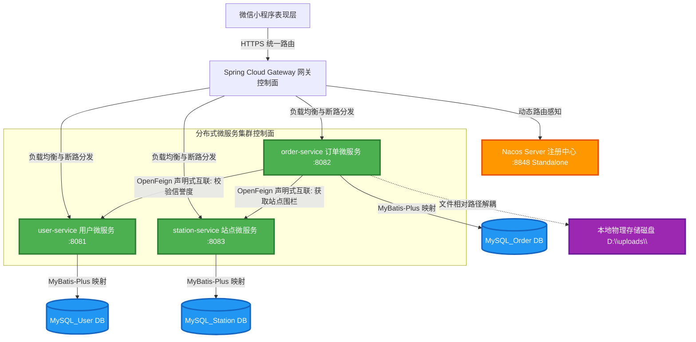
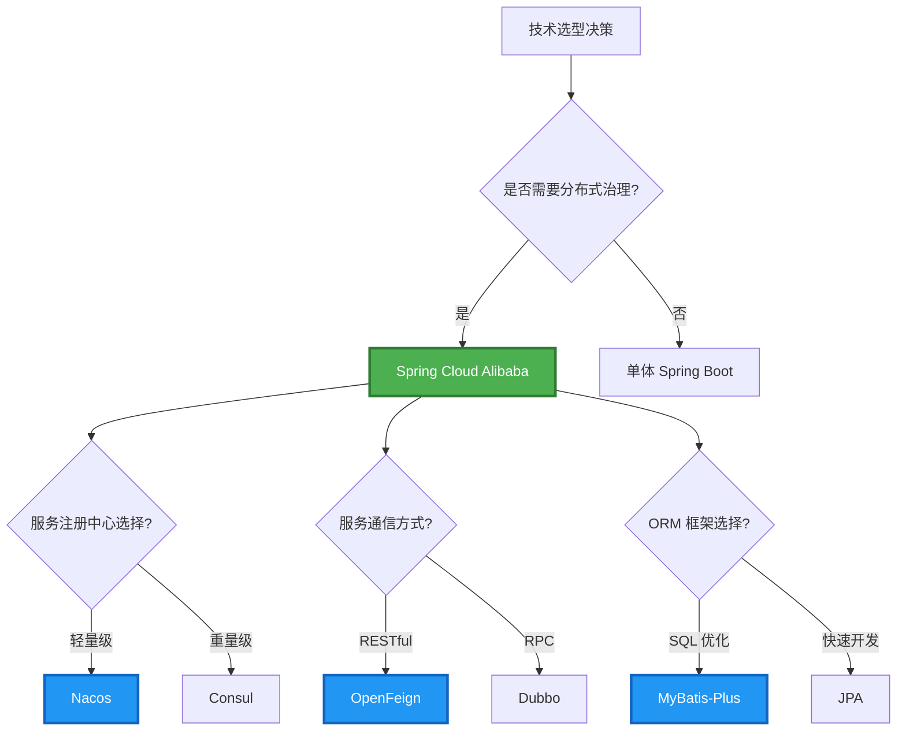
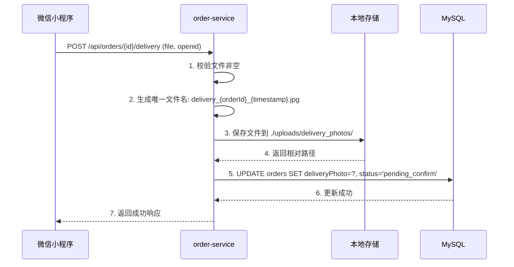
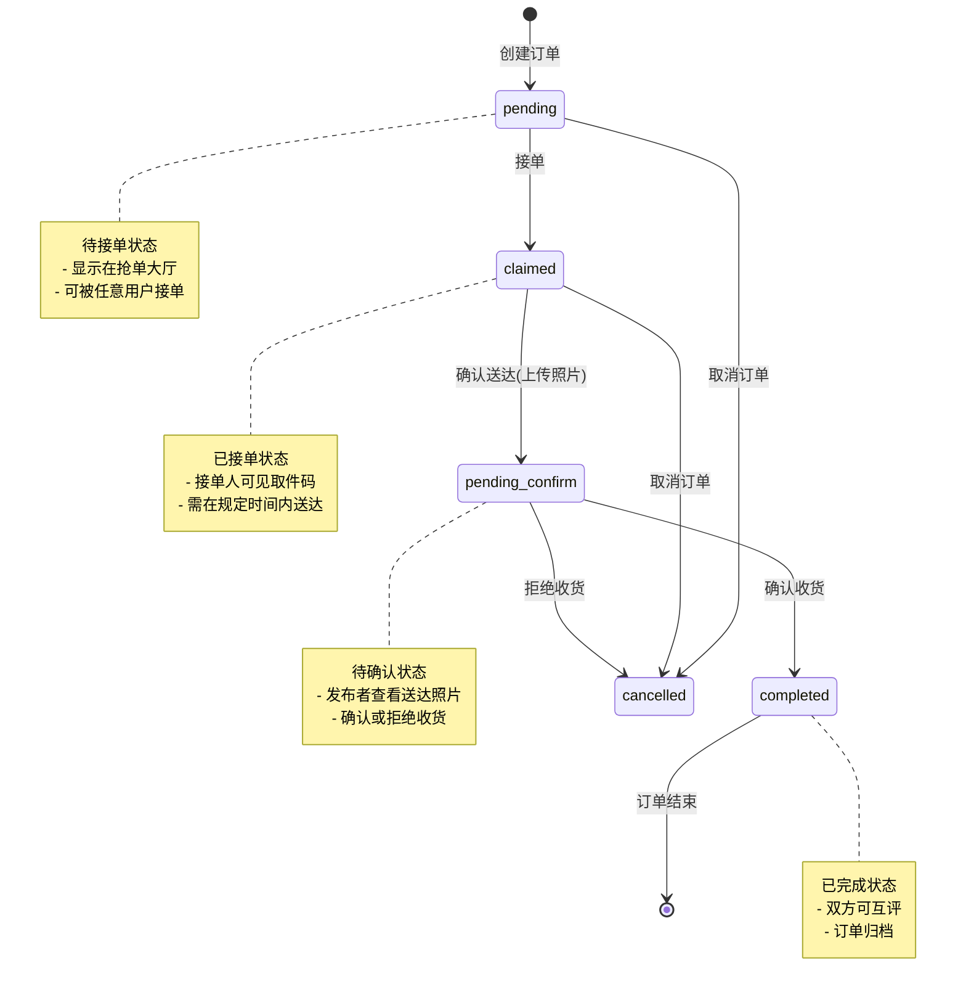
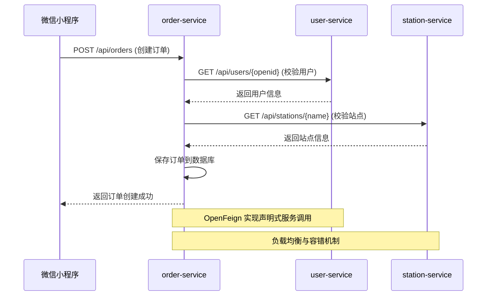
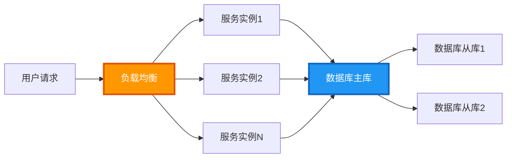

# 校园快递代取微服务系统 —— 核心设计与技术白皮书

本说明书作为系统的核心技术契约文档，全面覆盖了需求分析、微服务拓扑架构、技术选型矩阵以及高内聚的 API 接口设计，旨在证明本系统在分布式工程实践中的合理性与高可用性。

---

## 🎯 一、需求分析 (Requirement Analysis)

针对校园"最后一公里"快递高频、零散的取件痛点，系统深度抽象并打通了两个核心角色的分布式业务流：

### 1. 发布者核心用例

- **一键委托发布**：用户录入取件码、驿站名称、包裹大小（小件/大件/行李箱）及悬赏金额，向分布式集群发起订单创建。
- **回执即时校验**：订单送达后，发布者能够秒级调取接单人上传的多媒体物理凭证，确保包裹完好性，随后触发状态机确认收货。
- **信誉评价机制**：服务完成后，可对代取行为进行数字化信誉度量。

### 2. 接单者核心用例

- **高并发抢单大厅**：系统通过分布式列表高效承载、过滤并流转处于"待接单"状态的核心资产流。
- **物理回执存证**：送达目的地后，接单人调用多媒体文件接口拍摄并上传真实照片，驱动订单向"已送达"状态安全迁移。

---

## 🗺 二、系统拓扑架构图 (System Architecture Diagram)

系统全面基于 **Spring Cloud Alibaba** 治理体系，摒弃单体泥潭，设计了如下的**三维微服务拓扑矩阵**。以下为系统的核心数据流向与控制平面拓扑：



### 架构设计原则

| 设计原则 | 实现方式 | 技术价值 |
|---------|---------|---------|
| **服务自治** | 每个微服务独立数据库、独立部署 | 降低耦合度，提升系统弹性 |
| **无状态设计** | 服务实例可水平扩展 | 支持高并发场景 |
| **优雅降级** | deliveryPhoto 字段空值安全拦截 | 避免雪崩效应，保障核心功能 |
| **最终一致性** | 通过 OpenFeign 实现服务间数据同步 | 适应分布式环境下的数据一致性要求 |

---

## ⚙️ 三、技术选型矩阵 (Technology Selection Matrix)

### 3.1 后端技术栈选型

| 技术维度 | 选型方案 | 版本 | 选型依据 | 替代方案对比 |
|---------|---------|------|---------|-------------|
| **核心框架** | Spring Boot | 3.2.x | 生态成熟、自动配置、快速启动 | Spring MVC（配置繁琐） |
| **服务治理** | Spring Cloud Alibaba Nacos | 2023.0.1.0 | 轻量级、支持服务注册与发现、配置中心 | Eureka（已停止维护）、Consul（学习曲线陡峭） |
| **服务通信** | Spring Cloud OpenFeign | 4.1.x | 声明式 REST 客户端、集成 Ribbon 负载均衡 | RestTemplate（代码冗余）、Dubbo（RPC 协议复杂） |
| **ORM框架** | MyBatis-Plus | 3.5.x | 代码生成、通用 CRUD、分页插件 | JPA（性能损耗大）、MyBatis（手写 SQL 繁琐） |
| **数据库** | MySQL | 8.0+ | ACID 事务支持、成熟稳定 | PostgreSQL（学习成本高）、MongoDB（事务支持弱） |
| **API文档** | Knife4j | 4.4.x | Swagger UI 增强版、支持离线文档 | Swagger UI（功能单一） |
| **文件上传** | Spring Multipart | - | 原生支持、配置简单 | MinIO（引入额外组件） |

### 3.2 前端技术栈选型

| 技术维度 | 选型方案 | 版本 | 选型依据 |
|---------|---------|------|---------|
| **框架** | 微信小程序原生框架 | 3.16.x | 官方支持、性能优化、原生 API 丰富 |
| **语言** | JavaScript (ES6+) | - | 语法简洁、异步处理能力强 |
| **UI设计** | 自定义样式 | - | 轻量级、完全可控 |

### 3.3 技术选型决策树



---

## 🔌 四、高内聚 API 接口设计 (High Cohesion API Interface Design)

### 4.1 订单服务 API 契约

#### 4.1.1 创建订单

**接口定义**：

```java
@PostMapping("/api/orders")
public ResponseEntity<ApiResponse<OrderResponse>> createOrder(@RequestBody @Valid OrderRequest request)
```

**请求契约**：

| 字段 | 类型 | 必填 | 约束 | 说明 |
|------|------|------|------|------|
| `expressPoint` | String | 是 | @NotBlank, @Size(max=50) | 快递点名称 |
| `size` | String | 是 | @Pattern(regexp="small\|medium\|large") | 包裹大小 |
| `reward` | BigDecimal | 是 | @DecimalMin("0.01"), @DecimalMax("100") | 悬赏金额 |
| `pickupCode` | String | 是 | @NotBlank, @Size(min=4, max=10) | 取件码 |
| `dormBuilding` | String | 是 | @NotBlank, @Size(max=50) | 目标宿舍楼 |
| `showWechat` | Boolean | 否 | - | 是否显示微信号 |
| `wechat` | String | 否 | @Size(max=20) | 微信号 |
| `openid` | String | 是 | @NotBlank | 发布者 openid |

**响应契约**：

```json
{
  "success": true,
  "message": "订单创建成功",
  "data": {
    "_id": 1,
    "expressPoint": "菜鸟驿站",
    "size": "medium",
    "reward": 5.00,
    "pickupCode": "123456",
    "dormBuilding": "东苑3栋",
    "status": "pending",
    "createTime": "2026-06-16T10:00:00"
  }
}
```

**异常处理**：

| 异常场景 | HTTP 状态码 | 错误码 | 错误信息 |
|---------|-----------|--------|---------|
| 参数校验失败 | 400 | VALIDATION_ERROR | 参数校验失败：{field} {message} |
| 用户不存在 | 404 | USER_NOT_FOUND | 用户不存在 |
| 系统异常 | 500 | SYSTEM_ERROR | 系统异常，请稍后重试 |

#### 4.1.2 确认送达 / 上传回执

**接口定义**：

```java
@PostMapping("/api/orders/{id}/delivery")
public ResponseEntity<ApiResponse<OrderResponse>> confirmDelivery(
    @PathVariable Long id,
    @RequestParam("file") MultipartFile file,
    @RequestParam String openid)
```

**请求契约**：

| 参数 | 类型 | 必填 | 约束 | 说明 |
|------|------|------|------|------|
| `id` | Long | 是 | @PathVariable | 订单 ID |
| `file` | MultipartFile | 是 | @NotNull, @Size(max=5MB) | 送达照片文件 |
| `openid` | String | 是 | @RequestParam | 接单人 openid |

**文件处理流程**：



**响应契约**：

```json
{
  "success": true,
  "message": "送达成功，请等待对方确认",
  "data": {
    "_id": 1,
    "status": "pending_confirm",
    "deliveryPhoto": "/uploads/delivery_photos/delivery_1_1718512800000.jpg",
    "updateTime": "2026-06-16T10:30:00"
  }
}
```

**优雅降级策略**：

```java
// 后端：返回相对路径而非完整 URL
String relativePath = "/uploads/delivery_photos/" + filename;
response.setDeliveryPhoto(relativePath);

// 前端：formatDeliveryPhoto 函数处理空值和路径补全
formatDeliveryPhoto(photoUrl) {
  if (!photoUrl) return null;  // 空值拦截
  if (photoUrl.startsWith('wxfile://')) return photoUrl;  // 临时路径直接返回
  if (!photoUrl.startsWith('http')) {
    return 'http://localhost:8082' + photoUrl;  // 路径补全
  }
  return photoUrl;
}
```

#### 4.1.3 接单

**接口定义**：

```java
@PostMapping("/api/orders/accept")
public ResponseEntity<ApiResponse<OrderResponse>> acceptOrder(@RequestBody @Valid AcceptOrderRequest request)
```

**请求契约**：

| 字段 | 类型 | 必填 | 约束 | 说明 |
|------|------|------|------|------|
| `orderId` | Long | 是 | @NotNull | 订单 ID |
| `openid` | String | 是 | @NotBlank | 接单人 openid |

**响应契约**：

```json
{
  "success": true,
  "message": "接单成功",
  "data": {
    "_id": 1,
    "status": "claimed",
    "receiverOpenid": "test_openid_2",
    "pickupCode": "123456",
    "wechat": "wx123456"
  }
}
```

#### 4.1.4 获取订单详情

**接口定义**：

```java
@GetMapping("/api/orders/{id}")
public ResponseEntity<ApiResponse<OrderResponse>> getOrderById(@PathVariable Long id)
```

**请求契约**：

| 参数 | 类型 | 必填 | 说明 |
|------|------|------|------|
| `id` | Long | 是 | 订单 ID（路径参数） |

**响应契约**：

```json
{
  "success": true,
  "message": "获取成功",
  "data": {
    "_id": 1,
    "expressPoint": "菜鸟驿站",
    "size": "medium",
    "reward": 5.00,
    "pickupCode": "123456",
    "dormBuilding": "东苑3栋",
    "status": "claimed",
    "publisherOpenid": "test_openid_1",
    "receiverOpenid": "test_openid_2",
    "deliveryPhoto": "/uploads/delivery_photos/delivery_1_1718512800000.jpg",
    "createTime": "2026-06-16T10:00:00"
  }
}
```

#### 4.1.5 获取发布者订单列表

**接口定义**：

```java
@GetMapping("/api/orders/publisher/{openid}")
public ResponseEntity<ApiResponse<List<OrderResponse>>> getPublisherOrders(@PathVariable String openid)
```

**请求契约**：

| 参数 | 类型 | 必填 | 说明 |
|------|------|------|------|
| `openid` | String | 是 | 发布者 openid（路径参数） |

**响应契约**：

```json
{
  "success": true,
  "message": "获取成功",
  "data": [
    {
      "_id": 1,
      "expressPoint": "菜鸟驿站",
      "status": "pending",
      "size": "medium",
      "reward": 5.00,
      "receiverOpenid": null,
      "createTime": "2026-06-16T10:00:00"
    }
  ]
}
```

#### 4.1.6 获取接单者订单列表

**接口定义**：

```java
@GetMapping("/api/orders/receiver/{openid}")
public ResponseEntity<ApiResponse<List<OrderResponse>>> getReceiverOrders(@PathVariable String openid)
```

**请求契约**：

| 参数 | 类型 | 必填 | 说明 |
|------|------|------|------|
| `openid` | String | 是 | 接单者 openid（路径参数） |

**响应契约**：

```json
{
  "success": true,
  "message": "获取成功",
  "data": [
    {
      "_id": 5,
      "expressPoint": "顺丰快递",
      "status": "claimed",
      "size": "large",
      "reward": 8.00,
      "publisherOpenid": "test_openid_1",
      "claimedTime": "2026-06-16T10:30:00"
    }
  ]
}
```

#### 4.1.7 取消订单

**接口定义**：

```java
@PostMapping("/api/orders/{id}/cancel")
public ResponseEntity<ApiResponse<OrderResponse>> cancelOrder(
    @PathVariable Long id,
    @RequestParam String openid)
```

**请求契约**：

| 参数 | 类型 | 必填 | 说明 |
|------|------|------|------|
| `id` | Long | 是 | 订单 ID |
| `openid` | String | 是 | 操作人 openid |

**响应契约**：

```json
{
  "success": true,
  "message": "订单已取消",
  "data": {
    "_id": 1,
    "status": "cancelled",
    "updateTime": "2026-06-16T11:00:00"
  }
}
```

**状态校验**：

| 当前状态 | 是否可取消 |
|---------|-----------|
| pending | ✅ 是 |
| claimed | ✅ 是 |
| pending_confirm | ❌ 否 |
| completed | ❌ 否 |

#### 4.1.8 确认收货

**接口定义**：

```java
@PostMapping("/api/orders/{id}/confirm")
public ResponseEntity<ApiResponse<OrderResponse>> confirmReceipt(
    @PathVariable Long id,
    @RequestParam String openid)
```

**请求契约**：

| 参数 | 类型 | 必填 | 说明 |
|------|------|------|------|
| `id` | Long | 是 | 订单 ID |
| `openid` | String | 是 | 发布者 openid（仅发布者可确认） |

**响应契约**：

```json
{
  "success": true,
  "message": "确认收货成功",
  "data": {
    "_id": 1,
    "status": "completed",
    "finishTime": "2026-06-16T11:30:00"
  }
}
```

#### 4.1.9 创建评价

**接口定义**：

```java
@PostMapping("/api/reviews")
public ResponseEntity<ApiResponse<ReviewResponse>> createReview(@RequestBody @Valid ReviewRequest request)
```

**请求契约**：

| 字段 | 类型 | 必填 | 约束 | 说明 |
|------|------|------|------|------|
| `taskId` | Long | 是 | @NotNull | 订单 ID |
| `role` | String | 是 | @Pattern(publisher\|receiver) | 评价角色 |
| `rating` | Integer | 是 | @Min(1), @Max(5) | 总体评分 |
| `communicationRating` | Integer | 否 | @Min(1), @Max(5) | 沟通态度评分 |
| `speedRating` | Integer | 否 | @Min(1), @Max(5) | 取件速度评分 |
| `carefulnessRating` | Integer | 否 | @Min(1), @Max(5) | 包裹爱护评分 |
| `comment` | String | 否 | @Size(max=200) | 文字评语 |
| `fromOpenid` | String | 是 | @NotBlank | 评价者 openid |
| `toOpenid` | String | 是 | @NotBlank | 被评价者 openid |

**响应契约**：

```json
{
  "success": true,
  "message": "评价成功",
  "data": {
    "_id": 1,
    "taskId": 1,
    "rating": 5,
    "createTime": "2026-06-16T12:00:00"
  }
}
```

#### 4.1.10 获取用户信息

**接口定义**：

```java
@GetMapping("/api/users/{openid}")
public ResponseEntity<ApiResponse<UserResponse>> getUserByOpenid(@PathVariable String openid)
```

**请求契约**：

| 参数 | 类型 | 必填 | 说明 |
|------|------|------|------|
| `openid` | String | 是 | 用户 openid |

**响应契约**：

```json
{
  "success": true,
  "message": "获取成功",
  "data": {
    "openid": "test_openid_1",
    "nickname": "张三",
    "dormBuilding": "东苑3栋",
    "wechat": "wx123456",
    "reputationScore": 4.8,
    "totalOrders": 15,
    "createTime": "2026-05-01T00:00:00"
  }
}
```

#### 4.1.11 更新用户信息

**接口定义**：

```java
@PutMapping("/api/users/{openid}")
public ResponseEntity<ApiResponse<UserResponse>> updateUserInfo(
    @PathVariable String openid,
    @RequestBody @Valid UpdateUserRequest request)
```

**请求契约**：

| 字段 | 类型 | 必填 | 约束 | 说明 |
|------|------|------|------|------|
| `nickname` | String | 否 | @Size(max=20) | 昵称 |
| `dormBuilding` | String | 否 | @Size(max=50) | 宿舍楼 |
| `wechat` | String | 否 | @Size(max=20) | 微信号 |

**响应契约**：

```json
{
  "success": true,
  "message": "更新成功",
  "data": {
    "openid": "test_openid_1",
    "nickname": "张三（新）",
    "dormBuilding": "西苑5栋",
    "wechat": "wx654321"
  }
}
```

#### 4.1.12 获取快递点列表

**接口定义**：

```java
@GetMapping("/api/stations")
public ResponseEntity<ApiResponse<List<StationResponse>>> getAllStations()
```

**响应契约**：

```json
{
  "success": true,
  "message": "获取成功",
  "data": [
    {
      "id": 1,
      "name": "菜鸟驿站",
      "location": "东门快递中心",
      "businessHours": "08:00-22:00",
      "status": "active"
    },
    {
      "id": 2,
      "name": "顺丰快递",
      "location": "南门营业点",
      "businessHours": "09:00-21:00",
      "status": "active"
    }
  ]
}
```

### 4.2 订单状态机设计



### 4.3 服务间通信设计

#### 4.3.1 OpenFeign 客户端定义

```java
@FeignClient(name = "user-service", url = "http://localhost:8081")
public interface UserServiceClient {
    
    @GetMapping("/api/users/{openid}")
    ApiResponse<UserResponse> getUserByOpenid(@PathVariable String openid);
    
    @GetMapping("/api/users/{openid}/reputation")
    ApiResponse<ReputationResponse> getUserReputation(@PathVariable String openid);
}

@FeignClient(name = "station-service", url = "http://localhost:8083")
public interface StationServiceClient {
    
    @GetMapping("/api/stations/{name}")
    ApiResponse<StationResponse> getStationByName(@PathVariable String name);
}
```

#### 4.3.2 服务间调用时序图



### 4.4 API 设计最佳实践

| 设计原则 | 实现方式 | 示例 |
|---------|---------|------|
| **RESTful 风格** | 使用标准 HTTP 动词 | POST /api/orders, GET /api/orders/{id} |
| **统一响应格式** | ApiResponse 包装 | `{ success, message, data }` |
| **参数校验** | JSR-303 注解 | `@NotBlank`, `@Size`, `@Pattern` |
| **异常处理** | 全局异常处理器 | `@ControllerAdvice` |
| **API 文档** | Knife4j 自动生成 | 访问 /doc.html |
| **版本控制** | URL 路径版本 | /api/v1/orders |
| **幂等性** | 接口幂等设计 | 接单操作幂等校验 |

---

## 📊 五、系统性能与可扩展性 (System Performance & Scalability)

### 5.1 性能指标

| 指标 | 目标值 | 实现方式 |
|------|--------|---------|
| **响应时间** | < 200ms (P95) | 数据库索引优化、缓存策略 |
| **并发用户** | 1000+ | 服务水平扩展、连接池优化 |
| **可用性** | 99.9% | 服务降级、熔断机制 |
| **吞吐量** | 500 TPS | 异步处理、批量操作 |

### 5.2 可扩展性设计



---

## 🔒 六、安全设计 (Security Design)

### 6.1 认证与授权

| 安全机制 | 实现方式 | 覆盖范围 |
|---------|---------|---------|
| **用户认证** | 微信 openid | 所有需要身份的接口 |
| **接口授权** | openid 校验 | 订单操作权限控制 |
| **数据隔离** | openid 过滤 | 用户数据查询 |

### 6.2 数据安全

| 安全措施 | 实现方式 | 保护对象 |
|---------|---------|---------|
| **参数校验** | JSR-303 注解 | 防止 SQL 注入、XSS |
| **文件上传限制** | 文件类型、大小校验 | 防止恶意文件上传 |
| **敏感信息脱敏** | 微信号选择性显示 | 用户隐私保护 |

---

## 📝 七、总结 (Conclusion)

本系统基于 **Spring Cloud Alibaba** 微服务架构，通过服务拆分、服务注册与发现、声明式服务调用等核心技术，实现了校园快递代取业务的分布式部署。系统设计遵循高内聚、低耦合原则，通过优雅降级机制保障核心功能的可用性，为校园场景提供了高效、可靠的快递代取服务。

**核心价值**：

1. **架构演进**：从单体到微服务的平滑演进，验证了分布式架构的可行性
2. **技术选型**：基于成熟技术栈，降低技术风险，提升开发效率
3. **工程实践**：完整的需求分析、架构设计、API 设计、测试验证流程
4. **可扩展性**：支持水平扩展，适应未来业务增长需求

---

*本文档由《分布式系统开发》课程项目组编写，版本：v2.3.0，日期：2026-06-16*