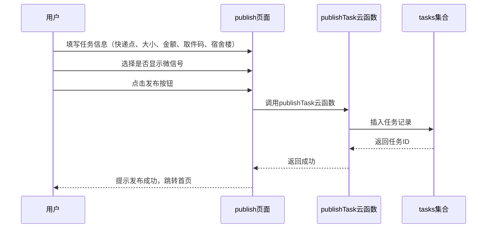
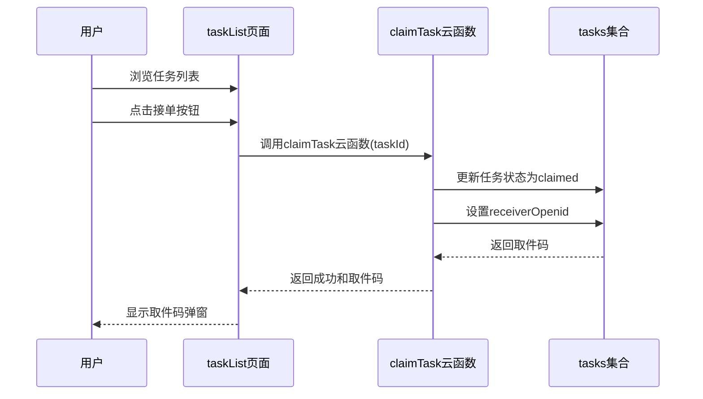
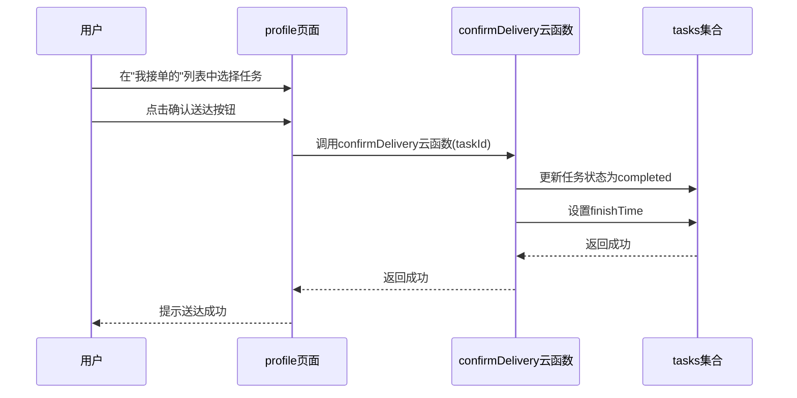

# 快递帮 - 系统设计文档

## 1. 需求分析

### 1.1 业务背景

随着高校学生网购需求的增加，快递代取成为校园生活中的常见需求。「快递帮」小程序旨在搭建一个校园快递代取互助平台，让有代取需求的学生发布任务，有时间的学生接单完成代取，通过悬赏机制激励互助行为。

### 1.2 用户需求

| 需求编号 | 需求描述 | 需求来源 |
|---------|---------|---------|
| REQ-001 | 用户可以发布快递代取任务 | 核心业务 |
| REQ-002 | 用户可以浏览和选择待接单任务 | 核心业务 |
| REQ-003 | 用户可以接单并获取取件码 | 核心业务 |
| REQ-004 | 用户可以确认送达完成任务 | 核心业务 |
| REQ-005 | 用户可以管理个人资料（昵称、宿舍楼、微信号） | 用户管理 |
| REQ-006 | 用户可以查看接单任务和发布任务列表 | 用户管理 |
| REQ-007 | 用户可以退出登录并重新授权 | 账号安全 |
| REQ-008 | 用户可以选择是否在任务中显示微信号 | 沟通需求 |
| REQ-009 | 用户可以复制发布者微信号进行沟通 | 沟通需求 |
| REQ-010 | 用户可以对完成的任务进行评价 | 信誉体系 |

### 1.3 功能边界

- **不支持**跨校区配送（仅校园内）
- **不支持**实时位置跟踪
- **不支持**在线支付（悬赏金额仅为虚拟激励）

---

## 2. 系统架构设计

### 2.1 架构概述

采用微信小程序原生框架 + 微信云开发的全栈方案，无需自建服务器，快速部署。
┌─────────────────────────────────────────────────────────────┐
│                        微信客户端                            │
├─────────────────────────────────────────────────────────────┤
│                       Pages (UI层)                          │
│  ├── index        - 首页（快递点选择）                       │
│  ├── taskList     - 任务列表页                              │
│  ├── publish      - 发布任务页                              │
│  └── profile      - 个人中心页                              │
├─────────────────────────────────────────────────────────────┤
│                  Cloud Functions (业务逻辑层)                │
│  ├── login            - 用户登录认证                         │
│  ├── publishTask      - 发布任务                            │
│  ├── claimTask        - 接单处理（含分布式锁）               │
│  ├── confirmDelivery  - 确认送达                            │
│  ├── getTaskList      - 获取任务列表                        │
│  ├── updateUserInfo   - 更新用户信息                        │
│  └── submitReview     - 提交评价                            │
├─────────────────────────────────────────────────────────────┤
│                   Cloud Database (数据层)                    │
│  ├── users    - 用户信息表                                   │
│  ├── tasks    - 任务信息表                                   │
│  └── reviews  - 评价信息表                                   │
└─────────────────────────────────────────────────────────────┘

### 2.2 核心业务流程

#### 2.2.1 任务发布流程



#### 2.2.2 接单流程



#### 2.2.3 确认送达流程



---

## 3. 数据库设计

### 3.1 用户表（users）

| 字段名 | 类型 | 约束 | 说明 |
|--------|------|------|------|
| `_id` | String | 主键 | 自动生成 |
| `openid` | String | 唯一索引 | 用户微信openid |
| `nickname` | String | 非空 | 用户昵称 |
| `dormBuilding` | String | 可空 | 宿舍楼（如"1栋"） |
| `wechat` | String | 可空 | 用户微信号 |
| `createTime` | Date | 自动 | 创建时间 |

**索引设计**：
- `openid`：唯一索引，用于快速查询用户

### 3.2 任务表（tasks）

| 字段名 | 类型 | 约束 | 说明 |
|--------|------|------|------|
| `_id` | String | 主键 | 自动生成 |
| `openid` | String | 索引 | 发布者openid |
| `expressPoint` | String | 非空 | 快递点名称 |
| `size` | String | 非空 | 包裹大小 |
| `reward` | Number | 非空 | 悬赏金额(1-10) |
| `pickupCode` | String | 非空 | 取件码 |
| `dormBuilding` | String | 非空 | 目标宿舍楼 |
| `showWechat` | Boolean | 默认false | 是否显示微信号 |
| `wechat` | String | 可空 | 发布者微信号 |
| `status` | String | 枚举 | pending/claimed/completed |
| `receiverOpenid` | String | 可空 | 接单人openid |
| `createTime` | Date | 自动 | 创建时间 |
| `finishTime` | Date | 可空 | 完成时间 |

**索引设计**：
- `openid`：索引，查询用户发布的任务
- `status`：索引，筛选任务状态
- `expressPoint`：索引，按快递点筛选

### 3.3 评价表（reviews）

| 字段名 | 类型 | 约束 | 说明 |
|--------|------|------|------|
| `_id` | String | 主键 | 自动生成 |
| `taskId` | String | 索引 | 关联任务ID |
| `fromOpenid` | String | 非空 | 评价者openid |
| `toOpenid` | String | 非空 | 被评价者openid |
| `role` | String | 枚举 | publisher/receiver |
| `rating` | Number | 非空(1-5) | 总体评分 |
| `dimensions` | Object | 非空 | 维度评分对象 |
| `comment` | String | 可空 | 文字评价 |
| `createTime` | Date | 自动 | 创建时间 |

**索引设计**：
- `taskId`：索引，查询任务评价
- `fromOpenid`：索引，查询用户评价记录
- `toOpenid`：索引，查询用户被评价记录

---

## 4. API 接口设计

### 4.1 云函数接口总览

| 云函数名 | 方法 | 功能描述 |
|---------|------|---------|
| `login` | GET | 用户登录，获取openid和用户信息 |
| `publishTask` | POST | 发布新任务 |
| `claimTask` | POST | 接单操作 |
| `confirmDelivery` | POST | 确认送达 |
| `getTaskList` | GET | 获取任务列表（分页） |
| `updateUserInfo` | POST | 更新用户信息 |
| `submitReview` | POST | 提交评价 |

### 4.2 接口详细设计

#### 4.2.1 login - 用户登录

**请求参数**：无（通过云函数上下文获取）

**成功响应**：
```json
{
  "success": true,
  "openid": "wx1234567890abcdef",
  "user": {
    "_id": "abc123",
    "nickname": "快递侠",
    "dormBuilding": "5栋",
    "wechat": "wx_123456"
  }
}
```

**失败响应**：
```json
{
  "success": false,
  "message": "登录失败"
}
```

#### 4.2.2 publishTask - 发布任务

**请求参数**：
| 参数名 | 类型 | 必填 | 说明 |
|--------|------|------|------|
| `expressPoint` | String | 是 | 快递点 |
| `size` | String | 是 | 包裹大小 |
| `reward` | Number | 是 | 悬赏金额 |
| `pickupCode` | String | 是 | 取件码 |
| `dormBuilding` | String | 是 | 宿舍楼 |
| `showWechat` | Boolean | 否 | 是否显示微信号 |
| `wechat` | String | 否 | 微信号 |

**成功响应**：
```json
{
  "success": true,
  "message": "发布成功",
  "taskId": "task_abc123"
}
```

**失败响应**：
```json
{
  "success": false,
  "message": "参数不完整"
}
```

#### 4.2.3 claimTask - 接单

**请求参数**：
| 参数名 | 类型 | 必填 | 说明 |
|--------|------|------|------|
| `taskId` | String | 是 | 任务ID |

**成功响应**：
```json
{
  "success": true,
  "pickupCode": "564085"
}
```

**失败响应**：
```json
{
  "success": false,
  "message": "任务已被接单"
}
```

#### 4.2.4 confirmDelivery - 确认送达

**请求参数**：
| 参数名 | 类型 | 必填 | 说明 |
|--------|------|------|------|
| `taskId` | String | 是 | 任务ID |

**成功响应**：
```json
{
  "success": true,
  "message": "送达成功"
}
```

**失败响应**：
```json
{
  "success": false,
  "message": "任务不存在"
}
```

#### 4.2.5 getTaskList - 获取任务列表

**请求参数**：
| 参数名 | 类型 | 必填 | 说明 |
|--------|------|------|------|
| `expressPoint` | String | 否 | 按快递点筛选 |
| `pageIndex` | Number | 否 | 页码（默认1） |
| `pageSize` | Number | 否 | 每页数量（默认10） |

**成功响应**：
```json
{
  "success": true,
  "data": [...],
  "total": 25
}
```

#### 4.2.6 updateUserInfo - 更新用户信息

**请求参数**：
| 参数名 | 类型 | 必填 | 说明 |
|--------|------|------|------|
| `nickname` | String | 是 | 用户昵称 |
| `dormBuilding` | String | 否 | 宿舍楼 |
| `wechat` | String | 否 | 微信号 |

**成功响应**：
```json
{
  "success": true,
  "message": "更新成功"
}
```

#### 4.2.7 submitReview - 提交评价

**请求参数**：
| 参数名 | 类型 | 必填 | 说明 |
|--------|------|------|------|
| `taskId` | String | 是 | 任务ID |
| `role` | String | 是 | 角色(publisher/receiver) |
| `rating` | Number | 是 | 总体评分(1-5) |
| `dimensions` | Object | 是 | 维度评分 |
| `comment` | String | 否 | 文字评价 |

**成功响应**：
```json
{
  "success": true,
  "message": "评价成功"
}
```

---

## 5. 页面设计

### 5.1 页面总览

| 页面路径 | 页面名称 | 功能描述 |
|---------|---------|---------|
| `/pages/index/index` | 首页 | 快递点选择入口 |
| `/pages/taskList/taskList` | 任务列表页 | 展示待接单任务 |
| `/pages/publish/publish` | 发布任务页 | 发布新任务表单 |
| `/pages/profile/profile` | 个人中心页 | 用户信息、任务管理 |

### 5.2 页面详细设计

#### 5.2.1 首页（index）

**功能**：展示三个快递点入口，显示各快递点待接单任务数量

**页面结构**：
- 顶部标题区域
- 三个快递点卡片（菜鸟驿站、国赛5号馆、阳光广场顺丰）
- 底部导航栏

**交互设计**：
- 点击快递点卡片跳转到对应快递点任务列表页

#### 5.2.2 任务列表页（taskList）

**功能**：展示指定快递点的待接单任务列表

**页面结构**：
- 顶部导航栏（显示快递点名称）
- 任务列表区域（下拉刷新、上拉加载更多）
- 任务卡片（包裹大小、悬赏金额、宿舍楼、发布时间）
- 接单按钮

**交互设计**：
- 下拉刷新：重新加载任务列表
- 上拉加载：加载下一页
- 点击接单按钮：调用接单接口，显示取件码弹窗

#### 5.2.3 发布任务页（publish）

**功能**：发布新的快递代取任务

**页面结构**：
- 表单区域：
  - 快递点选择（picker）
  - 包裹大小选择（picker）
  - 悬赏金额输入（数字输入框）
  - 取件码输入（文本输入框）
  - 宿舍楼选择（picker）
  - 显示微信号开关（switch）
- 发布按钮

**交互设计**：
- 表单验证：检查必填项
- 金额限制：1-10元
- 微信号显示：开启时检查是否已绑定微信号

#### 5.2.4 个人中心页（profile）

**功能**：用户信息展示和任务管理

**页面结构**：
- 用户卡片（头像、昵称、宿舍楼、微信号）
- 三个标签页：
  - 我接单的：显示已接单待配送任务
  - 我的发布：显示已发布任务（待接单/已被接单）
  - 历史记录：显示已完成任务
- 底部操作区：
  - 退出登录按钮
  - 模拟切换账号按钮（开发环境）
- 底部导航栏

**交互设计**：
- 点击编辑按钮：弹出编辑资料弹窗
- 点击确认送达：确认任务完成
- 点击取消发布：取消待接单任务
- 点击复制微信号：复制到剪贴板

---

## 6. 安全性设计

### 6.1 用户认证

- 使用微信官方登录机制（wx.login）获取openid
- 所有云函数通过 `cloud.getWXContext().OPENID` 验证用户身份
- 禁止直接传递openid，防止伪造

### 6.2 数据权限

| 集合 | 读权限 | 写权限 |
|------|-------|-------|
| `users` | 仅本人 | 仅本人 |
| `tasks` | 公开（仅pending状态） | 仅本人 |
| `reviews` | 仅关联用户 | 仅本人 |

### 6.3 输入验证

- 前端验证：表单必填项检查、格式检查、范围检查
- 后端验证：云函数二次验证，防止绕过前端验证
- SQL注入防护：使用云开发数据库API，自动防护SQL注入

### 6.4 敏感信息保护

- 微信号在用户卡片中部分隐藏显示（如 `wx****123`）
- 微信号仅在用户授权显示时对外暴露
- 取件码在接单成功后才显示

### 6.5 测试环境隔离

- 模拟切换账号功能仅在开发/体验版可用
- 生产环境应移除测试功能

---

## 7. 部署与运维

### 7.1 部署步骤

1. **云开发环境创建**：
   - 在微信开发者工具中创建云开发环境
   - 配置环境ID到 `app.js`

2. **云函数部署**：
   - 右键点击云函数文件夹
   - 选择「上传并部署：云端安装依赖」

3. **数据库集合创建**：
   - 在云开发控制台创建 `users`、`tasks`、`reviews` 集合
   - 配置权限规则

4. **权限配置**：
   ```javascript
   // users 集合权限
   {
     "read": "auth.openid == resource.data.openid",
     "write": "auth.openid == resource.data.openid"
   }
   
   // tasks 集合权限
   {
     "read": "resource.data.status == 'pending' || auth.openid == resource.data.openid || auth.openid == resource.data.receiverOpenid",
     "write": "auth.openid == resource.data.openid"
   }
   ```

### 7.2 监控与日志

- 云开发控制台提供实时日志查看
- 云函数错误自动上报
- 可配置告警通知

---

## 8. 代码规范

### 8.1 命名规范

- 文件命名：小写字母，单词之间用连字符（如 `task-list.js`）
- 变量命名：驼峰式（如 `userInfo`）
- 常量命名：大写字母，下划线分隔（如 `MAX_REWARD`）
- 函数命名：动词开头，驼峰式（如 `loadUserInfo`）

### 8.2 代码结构

- 每个页面包含：`.js`（逻辑）、`.wxml`（结构）、`.wxss`（样式）、`.json`（配置）
- 云函数包含：`index.js`（主逻辑）、`package.json`（依赖）

### 8.3 注释规范

- 函数开头注释：说明功能、参数、返回值
- 复杂逻辑注释：解释业务逻辑
- 特殊标记：`// TODO`、`// FIXME` 标记待完成或有问题的代码

### 8.4 错误处理

- 使用 try-catch 捕获异常
- 统一错误提示格式
- 记录错误日志便于排查

---

## 9. 版本计划

| 版本 | 功能 | 状态 |
|------|------|------|
| v1.0.0 | 基础功能（发布、接单、确认送达） | ✅ 已完成 |
| v1.1.0 | 个人中心重构、任务状态管理 | ✅ 已完成 |
| v1.2.0 | 账号管理（退出登录、模拟切换） | ✅ 已完成 |
| v1.3.0 | 微信号管理、一键复制 | ✅ 已完成 |
| v1.4.0 | 互评系统 | ✅ 已完成 |
| v2.0.0 | 消息通知、实时提醒 | 计划中 |
| v2.1.0 | 积分系统、排行榜 | 计划中 |